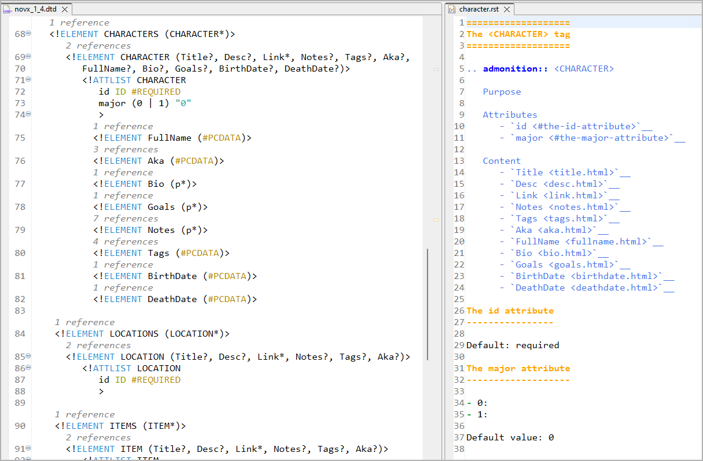

# dtd2rst

Generate a framework of rst pages for a DTD documentation.



## Features

- Creates one page per XML tag, named after the tag.
  Each page has a framework for documentation:
  
  - A first-level heading, containing the tag name.
  
  - A box containing the basic information:
      - Purpose (to be filled in manually).
      - A list of attributes.
      - A list of contained elements (page links).
      
  - A second-level heading for each attribute.
  
- Creates an index page with all tags.

## Usage
```
    dtd2rst.py <DTD path>

```

## Requirements

- Python v3.6+
- The lxml package

------------

## License

Published under the [MIT License](https://opensource.org/licenses/mit-license.php)
